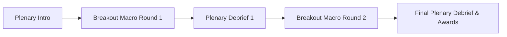
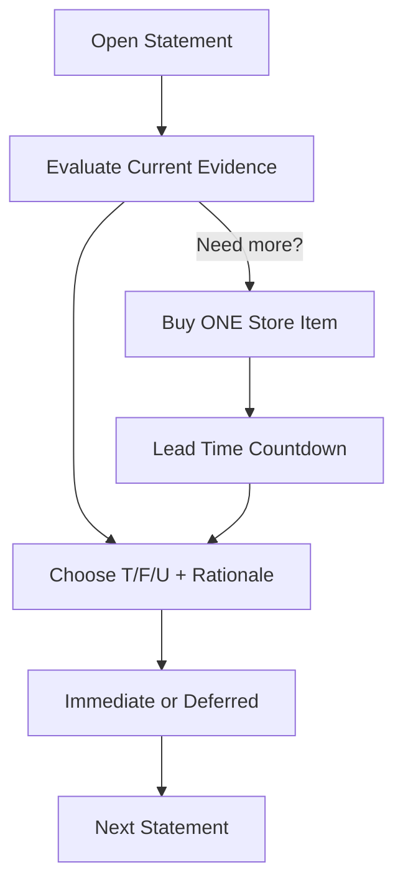

# Windsurf PRD – Data Literacy Game (60‑min Multiplayer, Zoom‑First)

> **Working title:** *Data Decisions: Pilot Pursuit*
>
> **Audience:** Learning professionals in a virtual conference (up to 500 participants in plenary; teams in Zoom breakouts)
>
> **Primary goal:** Practice data literacy by making **True / False / Unknown** calls on ambiguous statements while managing **time** and **budget** to purchase clarifying information.
>
> **Session length:** 60 minutes (plenary ↔ breakout cycles)

---

## 1) Product Summary
Multiplayer, time‑boxed, game‑like experience using a real sales‑pilot dataset. Teams may purchase **one** information item per statement (each has **lead time** + **money** costs). Teams complete as many statements as they can during breakout macro rounds; facilitator runs plenary intro/debrief loops.

### Success Criteria
- **Learning:** Confidence lift (pre/post), appropriate use of “Unknown,” stronger evidence‑based rationale.
- **Engagement:** ≥85% active participation; ≥8 statements/team average; sustained collaboration.
- **Operational:** Stable realtime sync; recall/lock fanout <1s P95; accessible UI.

### Non‑Goals (v1)
- LMS credit/SSO beyond token links; no in‑app voice (Zoom handles A/V); mobile is responsive but not primary.

---

## 2) Narrative & Core Loop
**Backstory:** A sales pilot concluded; leadership needs decisions now. Evidence is scattered and sometimes costly.

**Zoom‑first:** Alternate **plenary** (main room) ↔ **breakouts** (teams). In breakouts, teams can complete **any number** of statements within the time window.

### Macro vs Micro
- **Macro Round:** One breakout segment (e.g., 18 minutes) where teams process multiple statements.
- **Micro Turn:** One statement → (optional) buy one item → decide **T / F / U** + rationale → next.

#### Macro Flow


#### Micro Flow (per statement)


**Win Condition:** Highest team score (correctness − penalties + efficiency). Throughput and evidence quality showcased in debriefs.

---

## 3) Roles, Decider Rotation & Permissions
- **Player (Team Member):** View statements, chat, propose purchase, contribute rationale. **Interface:** `/play`.
- **Decider (rotating, verbal authority):** For each statement, one member is highlighted as **Decider**. Team can influence, but Decider *should* choose T/F/U. **v1 is non‑enforced** (anyone can submit); the UI highlights the Decider and records the name with the decision.
- **Team Lead (optional):** Break ties, **Skip Decider** to advance rotation, one budget override per session.
- **Facilitator/Admin:** Orchestrates rounds (start/recall/lock/extend), broadcasts hints, monitors teams, curates debrief. **Interfaces:** `/admin`, `/plenary`.

**RBAC:** Team users cannot access admin/plenary routes. Answer keys only load in facilitator context; never shipped to team clients pre‑reveal.

**Roster & Rotation:** On first load, teams enter **Team Name** + **comma‑delimited Member Names**. App generates a random rotation; pointer advances per statement, wraps; **Skip Decider** advances pointer.

---

## 4) Dual Interfaces (Clean, Professional, Game‑like)
### A) Team Interface (Decision‑Focused)
- **Setup Modal:** Team Name + names CSV → rotation preview (shuffle option).
- **Top bar:** Macro timer, team name, budget, **Decider banner** (Decider + Next), **Skip Decider**.
- **Left:** Statement card with tags/visual refs.
- **Center:** Decision controls (T/F/U) + rationale; lightweight chat (Zoom carries voice).
- **Right:** Store accordion; Delivery Timeline (lead‑time → arrival cards); persistent item chips.
- **A11y:** Keyboard‑first, ARIA, live regions (timer, Decider changes, deliveries), reduced motion, high contrast.

### B) Facilitator Interface (Oversight & Orchestration)
- **Plenary (`/plenary`):** Big‑screen leaderboard, accuracy vs spend, item ROI, exemplar statement carousel, countdown banners.
- **Console (`/admin`):** Start/Recall/Lock/Extend (+2/+5), broadcast; **Team Grid** tiles (throughput, accuracy, spend, stalled flag, last action). Tile → read‑only team snapshot. Optional store multipliers between rounds. WS health/lag indicators.

---

## 5) Mechanics, Economy & Scoring
- **Time:** ~60 minutes total; 2 macro rounds (e.g., 18 + 18). Items have **Lead Time** (1–5 min) that ticks during macro rounds.
- **Money:** Start budget **$1,000** (configurable). Items cost **$50–$400**; more value than budget allows.
- **Purchases:** **One item per statement** (server‑enforced). Some items are **persistent** (reusable); others are single‑use reveals.
- **Labels:** `true | false | unknowable` (so “Unknown” can be correct). Statements tagged by topic, difficulty, ambiguity, required evidence.
- **Scoring (defaults):** Correct T/F +100; correct Unknown +70; incorrect −80; no answer by recall −20. Efficiency bonus: +1/unused $10 and +1/unused 30s, applied at session end when ≥80% of available statements attempted **or** ≥12 completed.

---

## 6) Store Examples
| ID | Name | Category | $ | Lead (min) | Description | Output |
|---|---|---|---:|---:|---|---|
| I101 | Interview: Learning Team | People/Process | 250 | 3 | Collection caveats, instrumentation | Markdown transcript |
| I212 | Data Dictionary | Data Artifact | 120 | 1 | Field definitions & transforms | PDF/Markdown |
| I303 | Segment Drilldown | Analytics View | 180 | 2 | Choose 1 segment (region/role) | PNG/**Live Chart** |
| I407 | Randomization Check | Quality Check | 200 | 4 | Baseline equivalence | Table |
| I509 | Promo Calendar | Context Intel | 160 | 2 | Overlapping promos | Timeline PNG |
| I601 | Learning Dashboard: Win Rate (Observable) | Analytics View | 160 | 2 | Focused cell from Learning Dashboard | Observable cell (PNG fallback) |

> Some items are intentionally incomplete alone to teach triangulation.

---

## 7) Visualization Strategy
**Baseline v1 Content:** **Text** and **Images** (Markdown + PNG/JPEG) for reliability and speed.

**Optional Live‑Lite Charts (in‑app):**
- **Library:** **Recharts** (bar/line/area) for small, focused visuals rendered from pre‑computed slices.
- **Data source:** Pre‑computed aggregations (by region/role/time); no arbitrary queries.
- **A11y:** Alt text; ARIA descriptions; **Show Data Table** toggle.
- **Fallbacks:** Always provide PNG of the same view.

**Observable Cell Embeds (by cell):**
- **When:** You want learners focused on a specific view from an Observable notebook (e.g., Learning Dashboard).
- **Modes:**
  - **Iframe:** `https://observablehq.com/embed/d/<NOTEBOOK_ID>?cells=<CELL_NAME>`
  - **Runtime:** `@observablehq/runtime` loading `https://api.observablehq.com/d/<NOTEBOOK_ID>.js?v=3` and attaching a named cell.
- **Per‑item config:** `observable_config = { notebookId: "d/fb670ca5f330a7e9", cells: ["chart_winrate"], mode: "iframe", height: 540 }`
- **Privacy:** Prefer *unlisted* notebooks; avoid private auth for conferences.
- **Fallback:** `artifact_id` PNG.

**Flags:** `visualization_mode: static|live_lite` (default static), `live_charts_enabled` (allowlist controls Recharts/Observable).

---

## 8) Session Flow (Zoom + Breakouts)
1. **Plenary Intro (~8):** Context, rules, scoring, store demo. **Team Setup:** Team Name + CSV names → random Decider rotation shown. Open breakouts.
2. **Breakout – Macro Round 1 (~18):** Teams process as many statements as possible; Decider rotates per statement; one item per statement.
3. **Plenary Debrief 1 (~8):** Recall + lock; leaderboard, item ROI; exemplar statements (incl. unknowable); teaching points.
4. **Breakout – Macro Round 2 (~18):** Continue; rotation resumes; roster editable.
5. **Final Plenary (~8):** Results, smart purchases, unknowable cases; export; quick confidence poll.

---

## 9) Data & Content Pipeline
- **Upload:** Admin uploads pilot CSV/Parquet + metadata JSON; artifacts referenced via `artifact_id`.
- **Live‑Lite:** Server exposes fixed slices to widgets; no ad‑hoc queries in v1.

**Statement (JSON)**
```json
{
  "id": "S-001",
  "text": "Sales enablement training increased average deal size by 8% in Q3.",
  "topic": "Impact",
  "difficulty": 2,
  "ambiguity": 3,
  "truth_label": "false",
  "reason_key": "Seasonality confound; promo overlap",
  "required_evidence_types": ["segment_drilldown", "promo_calendar"],
  "recommended_items": ["I303", "I509"],
  "visual_refs": ["artifact:seg_drill_q3.png"]
}
```

**Store Item (Charts/Widgets)**
```json
{
  "id": "I303",
  "name": "Dashboard: Segment Drilldown",
  "category": "analytics_view",
  "cost_money": 180,
  "cost_time_min": 2,
  "delivery_type": "artifact|live_widget",
  "artifact_id": "seg_drill_q3.png",
  "widget_config": {"type": "bar", "dim": "region", "metric": "avg_deal_size"}
}
```

**Store Item (Observable Cell)**
```json
{
  "id": "I601",
  "name": "Learning Dashboard: Win Rate (Observable)",
  "category": "analytics_view",
  "cost_money": 160,
  "cost_time_min": 2,
  "delivery_type": "observable_cell",
  "observable_config": {
    "notebookId": "d/fb670ca5f330a7e9",
    "cells": ["chart_winrate"],
    "mode": "iframe",
    "height": 540
  },
  "artifact_id": "learning_winrate.png"
}
```

---

## 10) Data Model
- **sessions**(id, title, mode, start_at, end_at)
- **teams**(id, session_id, name, budget_remaining, time_remaining, members_json, decider_order_json, decider_pointer)
- **statements**(id, session_id, text, topic, difficulty, ambiguity, truth_label, reason_key, metadata_json)
- **rounds**(id, team_id, statement_id, started_at, ended_at)
- **purchases**(id, team_id, round_id, item_id, cost_money, cost_time_min, delivered_at)
- **items**(id, session_id, name, category, cost_money, cost_time_min, delivery_type, artifact_id, widget_config_json)
- **decisions**(id, round_id, team_id, choice, rationale, correct, points_awarded, decider_name)
- **telemetry**(id, session_id, team_id, round_id, event_type, payload_json, ts)

---

## 11) APIs & Events
- `POST /api/session/:id/join` → { teamId, token }
- `GET /api/session/:id/state` → room state
- `POST /api/team/:id/setup` → { teamName, membersCsv } → roster + decider order + pointer
- `POST /api/team/:id/decider/next` → advance pointer
- `POST /api/team/:id/purchase` → { itemId } → 202 + delivery ETA
- `POST /api/team/:id/decision` → { statementId, choice, rationale, deciderName }
- `GET /api/admin/:id/overview` → live metrics
- `POST /api/admin/:id/broadcast` → { message }

**WebSocket:** `macro_round:start`, `macro_round:recall`, `macro_round:stop`, `admin:broadcast`, `admin:lock_submissions`, `state:update`, `timer:tock`, `purchase:accepted`, `purchase:delivered`, `decision:locked`

---

## 12) Architecture & Tech
- **Client:** React/Next.js (or Vite), Tailwind + shadcn/ui, Recharts, **Observable embeds** (iframe or runtime), WS realtime.
- **Server:** Node/Express or serverless; state machine; timers authoritative.
- **Storage:** Postgres + object storage for artifacts and PNG fallbacks.
- **Auth:** Magic‑link or event token; team auto‑assignment.
- **Feature Flags (example):**
```json
{
  "feature_flags": {
    "visualization_mode": "static",
    "live_charts_enabled": false,
    "deferred_feedback": false,
    "majority_vote": true,
    "rationale_rubric": false,
    "decider_mode": "verbal"
  }
}
```

---

## 13) Analytics, Acceptance & Tests
**Acceptance (v1):**
- Zoom cadence supported; dual interfaces; Team Setup modal with CSV names; Decider banner & Skip
- One purchase per statement; lead time affects macro clock; persistent items saved across rounds
- Recall + lock <1s P95; lock state reflected in UIs
- **Recharts and Observable cell embeds** work when enabled; each has a **PNG fallback**; data‑table toggle for charts
- A11y checks pass primary flows

**Test Plan (selected):**
- Unit: rotation generate/advance/wrap; Skip Decider; purchase lock; score calc; timers; reconnect + recall
- Integration: Zoom choreography; admin broadcasts; facilitator snapshots; Observable cell embed load (iframe & runtime), fallback to PNG
- Load: 500 participants; WS fanout; snapshot fetch P95 < 800ms
- UX: Team first decision <5 min; facilitator find team in ≤3 clicks; plenary charts readable

---

## 14) Appendices
**Sample Statements (CSV)**
```csv
id,text,topic,difficulty,ambiguity,truth_label,reason_key,recommended_items
S-001,"Sales enablement training increased average deal size by 8% in Q3.",Impact,2,3,false,"Seasonality & promo overlap","I303|I509"
S-002,"Pilot regions had significantly higher close rates than control.",Impact,3,2,true,"p<0.05 when controlling for pipeline stage","I407|I303"
S-003,"Time‑to‑first‑contact improved due to the training.",Process,2,4,unknowable,"CRM timestamp mismatch across cohorts","I212|I407"
```

**Sample Items (CSV)**
```csv
id,name,category,cost_money,cost_time_min,delivery_type,artifact_id
I101,Interview: Learning Team,people_process,250,3,artifact,int_learning_team.pdf
I212,Data Dictionary,data_artifact,120,1,artifact,data_dictionary.pdf
I303,Dashboard: Segment Drilldown,analytics_view,180,2,artifact,seg_drill_q3.png
I407,Randomization Check,quality_check,200,4,artifact,rand_check_table.pdf
I509,Promo Calendar,context_intel,160,2,artifact,promo_calendar.png
I601,Learning Dashboard: Win Rate (Observable),analytics_view,160,2,observable_cell,learning_winrate.png
```

**Observable Embed Examples**
- Iframe (cell):
```
https://observablehq.com/embed/d/fb670ca5f330a7e9?cells=chart_winrate
```
- Runtime (cell):
```js
import { Runtime, Inspector } from "@observablehq/runtime";
const NOTEBOOK = "https://api.observablehq.com/d/fb670ca5f330a7e9.js?v=3";
const runtime = new Runtime();
runtime.module((await import(NOTEBOOK)).default, name => name === "chart_winrate" ? new Inspector(document.querySelector('#target')) : null);
```

---

*End of PRD v1.4 (Observable Cell Embeds + Recharts)*
